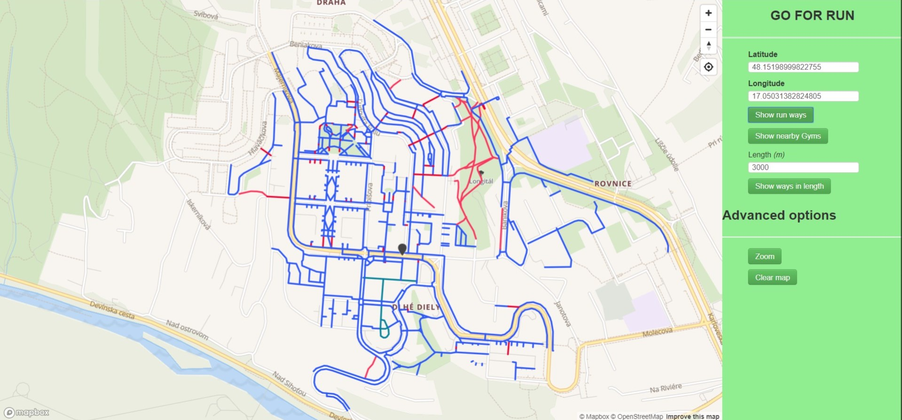
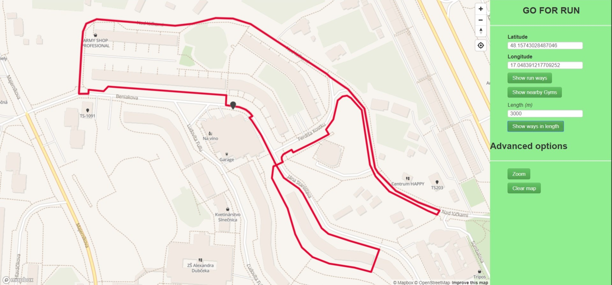
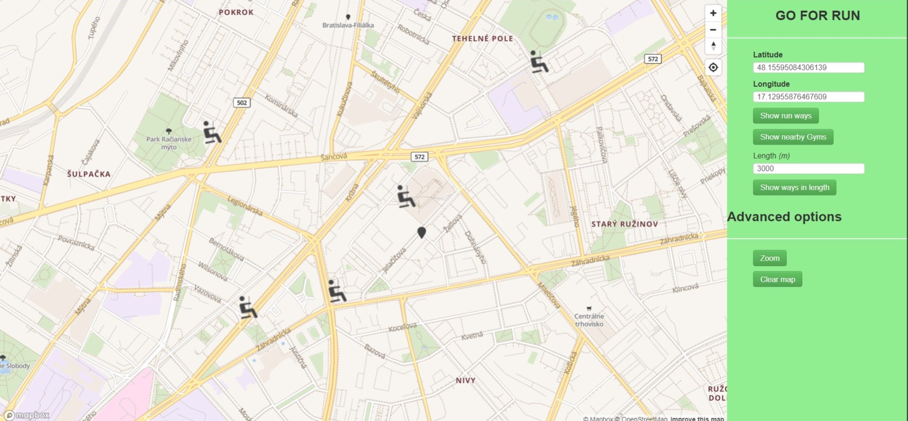

# Uvod
Aplikacia sluzi pre ludi, ktori si chcu zabehat. Pouzivatelom je ponuknutych niekolko funkcii, ktorymi su:
- zobrazenie vsetkych bezeckych ciest v okruhu 500 metrov (resp. vsetky cesty, ktorymi nejazdia auta),
- navrhnutie trasy na beh v urcitej vzdialenosti, ktore si pouzivatel vyberie,
- vyhladanie vsetkych fitness centier v okruhu 500 metrov.

Scenar 1:

Scenar 2:

Scenar 3:

# Frontend
Graficke pouzivatelske rozhranie pozostava z dvoch casti:
	- mapa,
	- bocny panel.
Bocny panel obsahuje niekolko tlacidiel, ktore poskytuju hlavnu funkcionalitu aplikacie. 
Prvou ulohou pouzivatela, po zapnuti aplikacie, je kliknut na mapu, kde sa nachadza alebo z ktoreho miesta chce vykonavat jednotlive funkcie ponukane aplikaciou. 
Po kliknuti na mapu sa na danom mieste zobrazi marker a upravia sa koordinaty v bocnom panely.
Teraz moze pouzit tlacidlo "Show run ways", ktorym sa zobrazia bezecke drahy v okoli bodu, ktory si vybral.
Druhym tlacidlom je tlacidlo s nazvom "Show nearby Gyms", ktorym sa zobrazia vsetky fitness centra v okoli.
Poslednou moznostou je zobrazenie trasy na beh pomocou tlacidla "Show ways in length".
Zadanim dlzky behu a tlacenim tohto tlacidla sa po chvili zobrazi okruh, ktory je vo vzdialenosti, ktoru zadal pouzivatel.
Tato funckia je vytvorena pomocou rekurzivneho algoritmu backtracking.
Doplnujucimi funkcia su zoom (animovanane priblizenie mapy) a clear (vycistenie mapy).

# Backend
Aplikcia je naimplementovana v ASP.NET, pricom backend je v jazyku C#. Hlavnou maskou je Map.aspx, ktora obsahuje webservisy pre jednotlive funkcie.
Z tychto funkcii dopytuje na databazu, z ktorej sa data vracaju vo formate geojson. Jednotlive sql funkcie sa nachadzaju v priecinku SqlScripts.
Komunikacia medzi frontendom a backendom je zabezpecena pomocou asax funkcii.

## Data
Data su zo stranky OpenStreetMaps a obsahuju data z Bratislavy. Importovane do databazy boli pomocou programu osm2pgsql.
